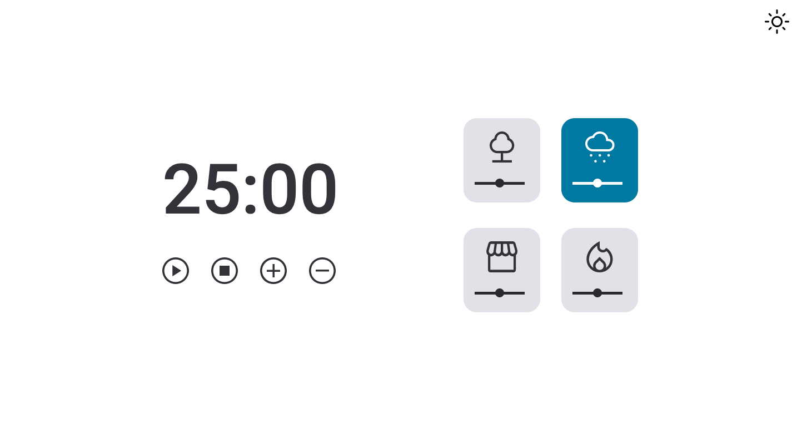
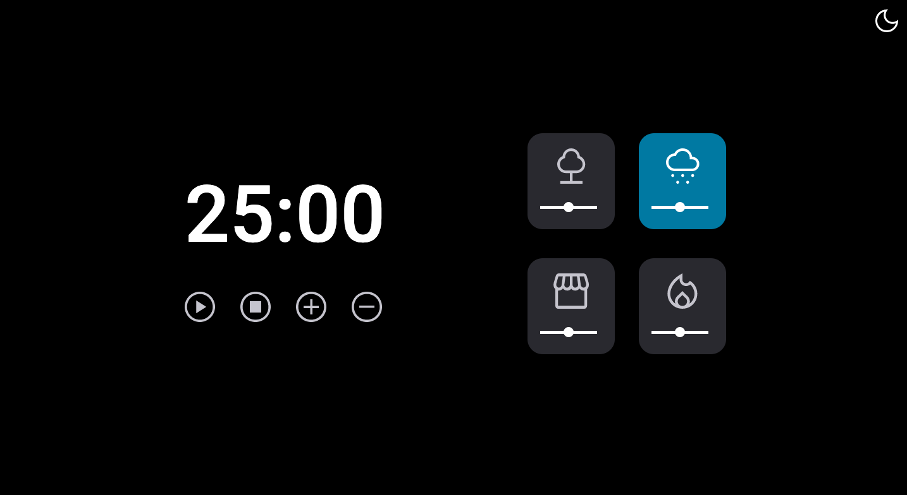

<h1 align="center"> Focus Timer Version 2.0 - Including Dark Mode </h1>

  <a href="#-tecnologias">Technology</a>&nbsp;&nbsp;&nbsp;|&nbsp;&nbsp;&nbsp;
  <a href="#-projeto">Project</a>&nbsp;&nbsp;&nbsp;|&nbsp;&nbsp;&nbsp;
  <a href="#-layout">Layout</a>&nbsp;&nbsp;&nbsp;|&nbsp;&nbsp;&nbsp;
  <a href="#memo-licença">License</a>

 

<h2 align="center"> Design </h2>

  
   
  

## 🚀 Technology

This project was developed with the technologies below:

- HTML and CSS
- Git and Github
- JavaScript

## 💻 Project

This is the third version of the focus timer, which now includes a dark mode. By clicking the icon in the upper right-hand corner of the screen, you can change the background color of the focus timer. Additionally, by clicking on the numbers that indicate the focus timer, you can customize the timer as desired. In this version, we have also added a slider button to adjust the volume.

The technologies used in this application are listed below:

- Imperative Programming
- Declarative Programming
- New DOM methods
- Function Recursion
- Factory Pattern 
- Audio Manipulation

  

## :memo: License

This project is above the MIT license.

## link

<a href="https://gustavozonta.github.io/focustimer-2.0-dark/" target="_blank"> Focus Timer 2.0 - Dark Mode</a>

---

 Made  ♥  by Gustavo Zonta
